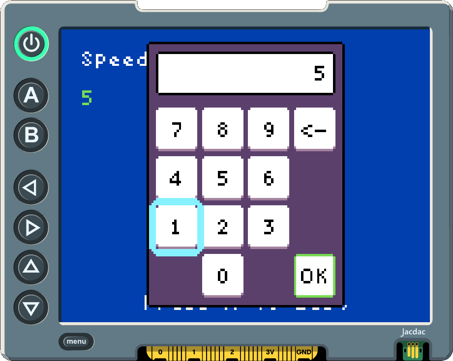
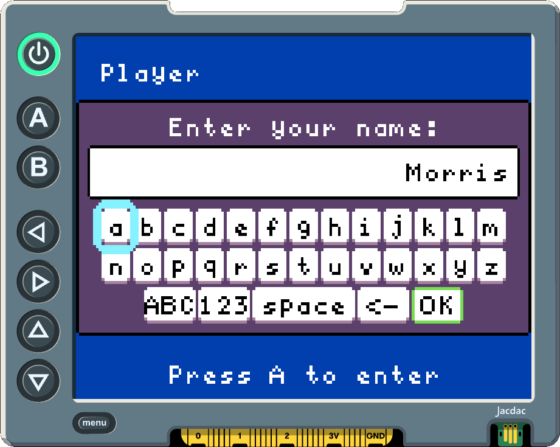
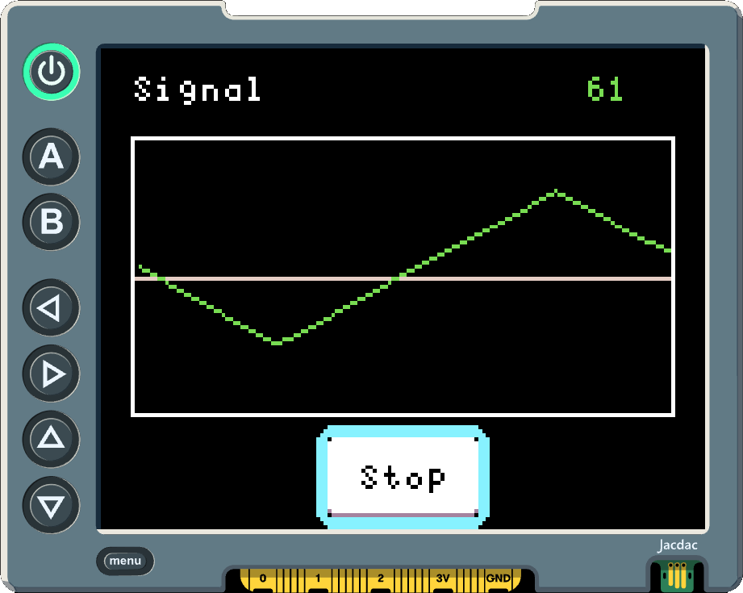

# **ui-controls** for micro:bit apps

**ui-controls** is the controls layer of a small UI toolkit for building [micro:bit apps](https://microbit-apps.org/): apps that run on the [BBC micro:bit](https://microbit.org/) + [Display Shield](https://microbit-apps.org/getting-started/display-shields/).

It builds on [**ui-core**](https://github.com/humanapp/ui-core) and adds reusable controls and modal UI: labels, buttons, pickers, and the numeric and text entry keypads.

## The Short Version

**ui-controls** layers on top of **ui-core**:

- Add `UiLabel` and `UiButton` to a screen with `add()` instead of writing a
  custom `render()` method for text or activation.
- Open a `UiPicker` for a short modal choice such as a confirmation dialog.
- Open a `UiNumericEntryModal` for number entry through a built-in keypad.
- Open a `UiTextEntryModal` for short string entry through a compact keyboard.

Screens, the runtime, semantic input, and drawing primitives all come from
**ui-core**.

## 1. Add Labels And Buttons

`UiLabel` is the simplest way to keep text on a screen without writing a custom
`render()` method. `UiButton` owns activation and focus. Both are placed with
`add()`.

```ts
class StartScreen extends ui.UiScreen {
    private status: "Ready" | "Started" | "Stopped"
    private statusLabel: ui.UiLabel
    private toggleButton: ui.UiButton

    constructor(runtime: ui.UiRuntime) {
        super(runtime)
        this.status = "Ready"
        this.statusLabel = new ui.UiLabel(this.status, 1)
        this.toggleButton = new ui.UiButton("start", "Start", () => {
            this.status = this.status == "Started" ? "Stopped" : "Started"
            this.statusLabel.setText(this.status)
            this.toggleButton.setText(
                this.status == "Started" ? "Stop" : "Start",
            )
        })
        this.add(this.statusLabel, { x: 8, y: 8 })
        this.add(this.toggleButton, { centerX: 80, centerY: 60 })
    }
}
```

Use `UiButtonView` directly only when you need the lower-level renderer. For
custom reusable controls, implement a `UiFocusableView` and add it to a screen
with `add()` or `addCentered()`. The screen will arrange it, register its focus
targets, route input to it, and render it each frame.

When a fixed control size is needed, use `size: { width, height }` on a single
button or label. Pickers use `controlSize: { width, height }` for repeated
control cells.

## 2. Open A Numeric Keypad

**ui-controls** includes a modal keypad for number entry. For positive
integer entry, open it from a screen with an initial value and a completion
handler.

```ts
class SettingsScreen extends ui.UiScreen {
    private speed: number
    private speedLabel: ui.UiLabel

    constructor(runtime: ui.UiRuntime) {
        super(runtime)
        this.speed = 5
        this.backgroundColor = 8
        this.add(new ui.UiLabel("Speed", 1), { x: 8, y: 8 })
        this.speedLabel = new ui.UiLabel("" + this.speed, 7)
        this.add(this.speedLabel, { x: 8, y: 24 })
        this.add(new ui.UiLabel("Press A to Edit", 1), {
            centerX: 80,
            y: 108,
        })
    }

    public handleInput(event: ui.UiInputEvent): boolean | undefined {
        if (event.action == "activate" && event.phase != "released") {
            this.openSpeedEditor()
            return true
        }

        return undefined
    }

    private openSpeedEditor(): void {
        this.openModal(
            new ui.UiNumericEntryModal("speed-editor", this.speed, value => {
                this.speed = value
                this.speedLabel.setText("" + value)
            }),
        )
    }
}
```

<p align="center">
    
</p>

While a modal is open, the screen routes input to the modal first. The numeric
keypad uses the same semantic input actions as the rest of the runtime. OK emits
a `completed` result and closes the modal automatically. If a screen overrides
`render()`, call `super.render(surface)` after drawing the screen background and
content. The base render method draws screen-owned views and the active modal on
top of the screen.

## 3. Confirmation Dialog

Use `UiPicker` for simple modal choices. It owns modal focus, button layout,
directional navigation, rendering, activation, and cancel handling.

```ts
class SaveScreen extends ui.UiScreen {
    private status: string
    private statusLabel: ui.UiLabel

    constructor(runtime: ui.UiRuntime) {
        super(runtime)
        this.status = "Not saved"
        this.backgroundColor = 8
        this.statusLabel = new ui.UiLabel(`Status: ${this.status}`, 7)
        this.add(this.statusLabel, { x: 8, y: 8 })
        this.add(new ui.UiLabel("Press A to save", 1), { x: 8, y: 18 })
    }

    public handleInput(event: ui.UiInputEvent): boolean | undefined {
        if (event.action == "activate" && event.phase != "released") {
            this.openConfirmDialog()
            return true
        }

        return undefined
    }

    private openConfirmDialog(): void {
        const modal = new ui.UiPicker(
            "save-dialog",
            "Save changes?",
            ["Cancel", "OK"],
            choice => {
                this.status = choice == "OK" ? "Saved" : "Cancelled"
                this.statusLabel.setText(`Status: ${this.status}`)
            },
            () => {
                this.status = "Cancelled"
                this.statusLabel.setText(`Status: ${this.status}`)
            },
        )

        this.openModal(modal)
    }
}
```

## 4. Text Entry Modal

Use `UiTextEntryModal` for short strings such as names or titles. The
modal owns the compact keyboard, and the screen updates its state when the modal
returns a completed result.

```ts
class NameEntryScreen extends ui.UiScreen {
    private name: string
    private nameLabel: ui.UiLabel

    constructor(runtime: ui.UiRuntime) {
        super(runtime)
        this.name = ""
        this.backgroundColor = 8
        this.add(new ui.UiLabel("Player", 1), { x: 8, y: 8 })
        this.nameLabel = new ui.UiLabel("No name", 7)
        this.add(this.nameLabel, { x: 8, y: 24 })
        this.add(new ui.UiLabel("Press A to enter", 1), {
            centerX: 80,
            y: 108,
        })
    }

    public handleInput(event: ui.UiInputEvent): boolean | undefined {
        if (event.action == "activate" && event.phase != "released") {
            this.openNameEditor()
            return true
        }

        return undefined
    }

    private openNameEditor(): void {
        this.openModal(
            new ui.UiTextEntryModal({
                modalScopeId: "name-editor",
                title: "Enter your name:",
                initialText: this.name,
                allowWhitespace: true,
                allowSymbols: true,
                maxLength: 16,
                onResult: result => {
                    if (result.kind == "completed") {
                        this.name = result.text
                        this.nameLabel.setText(
                            this.name.length ? this.name : "No name",
                        )
                    }
                },
            }),
        )
    }
}
```

<p align="center">
    
</p>

## 5. Mix Controls With Custom Drawing

Controls and direct drawing share the same screen. For a custom visualization,
keep the data and controls in the screen, update it over time, and draw directly
to the `DrawSurface`.

```ts
class DataGraphScreen extends ui.UiScreen {
    private values: number[]
    private tick: number
    private graphRect: ui.Rect
    private valueLabel: ui.UiLabel
    private toggleButton: ui.UiButton
    private running: boolean

    constructor(runtime: ui.UiRuntime) {
        super(runtime)
        this.backgroundColor = 1
        this.tick = 0
        this.running = true
        this.graphRect = new ui.Rect(8, 22, 144, 70)
        this.add(new ui.UiLabel("Signal", 1), { x: 8, y: 6 })
        this.toggleButton = new ui.UiButton("toggle", "Stop", () => {
            this.running = !this.running
            this.toggleButton.setText(this.running ? "Stop" : "Start")
        })
        this.values = [
            24, 28, 35, 40, 46, 52, 58, 63, 68, 72, 70, 66, 60, 54, 48, 42, 36,
            31, 27, 25,
        ]
        this.valueLabel = new ui.UiLabel(
            "" + this.values[this.values.length - 1],
            7,
        )
        this.add(this.valueLabel, { x: 128, y: 6 })
        this.add(this.toggleButton, { centerX: 80, centerY: 107 })
    }

    public update(): void {
        if (!this.running) return

        this.tick += 1
        if (this.tick % 6 != 0) return

        const phase = Math.idiv(this.tick, 6) % 20
        const wave = phase < 10 ? phase : 20 - phase
        this.values.removeAt(0)
        this.values.push(25 + wave * 6)
        this.valueLabel.setText("" + this.values[this.values.length - 1])
    }

    public render(surface: ui.DrawSurface): void {
        surface.drawRect(this.graphRect, 1)
        surface.drawLine(
            this.graphRect.x + 1,
            this.graphRect.y + Math.idiv(this.graphRect.height, 2),
            this.graphRect.x + this.graphRect.width - 2,
            this.graphRect.y + Math.idiv(this.graphRect.height, 2),
            13,
        )

        let previousX = 0
        let previousY = 0
        for (let i = 0; i < this.values.length; i++) {
            const x =
                this.graphRect.x +
                2 +
                Math.idiv(
                    i * (this.graphRect.width - 4),
                    this.values.length - 1,
                )
            const y =
                this.graphRect.y +
                this.graphRect.height -
                3 -
                Math.idiv(this.values[i] * (this.graphRect.height - 6), 100)

            if (i > 0) surface.drawLine(previousX, previousY, x, y, 7)
            previousX = x
            previousY = y
        }

        super.render(surface)
    }
}
```

<p align="center">
    
</p>

## A Few Working Rules

- Use screen modals for short blocking tasks such as number entry, text entry,
  and confirmation dialogs.
- Prefer `UiLabel` and `UiButton` over custom `render()` for static text and
  activation. Drop down to custom drawing on the `DrawSurface` when the screen
  needs something the controls do not provide.
- Reuse `Rect`, `Size`, and `UiMeasuredSize` objects in frame code when practical. Avoid allocations in the render callback.

## Using **ui-controls**

**ui-controls** is a MakeCode extension. It depends on [**ui-core**](https://github.com/humanapp/ui-core); adding **ui-controls** to a project will bring **ui-core** in automatically. There are two normal ways to use it:

- **Work in the MakeCode Editor** when you want the in-editor project workflow.
- **Work in VS Code** when you want files on disk, source control, and command-line
  builds.

### Workflow 1: MakeCode Editor

Use this workflow when you want to build in the browser and let MakeCode manage
the project.

You need:

- The [MakeCode editor for micro:bit](https://makecode.microbit.org).
- A [BBC micro:bit](https://microbit.org/) and [Display Shield](https://microbit-apps.org/getting-started/display-shields/) when you want to run on hardware.

To add **ui-controls**:

1. Open `https://makecode.microbit.org` and create or open a project.
2. Open the Extensions window from the toolbox.
3. Paste this repository URL into the extension search box:

    ```text
    https://github.com/humanapp/ui-controls
    ```

4. Select the extension when MakeCode finds it.
5. Switch to JavaScript view and use the `ui` namespace.

### Workflow 2: VS Code

Use this workflow when you want a local project folder that can be edited in
VS Code and built from the command line.

You need:

- [VS Code](https://code.visualstudio.com/download)
- [Node.js and npm](https://nodejs.org/en/download)
- The
  [Microsoft MakeCode Arcade VS Code extension](https://marketplace.visualstudio.com/items?itemName=ms-edu.pxt-vscode-web).
  Despite the name, it also works for micro:bit projects and is especially
  useful for running the MakeCode simulator from VS Code.
- The MakeCode command-line tool:

    ```sh
    npm install -g makecode
    ```

- A BBC micro:bit and Display Shield when you want to run on hardware.

To create a new local micro:bit project:

```sh
mkc init microbit
mkc add https://github.com/humanapp/ui-controls ui-controls
mkc build
```

Then open the folder in VS Code. Use the MakeCode icon in the activity bar to
open the MakeCode Action Palette. From there you can start the MakeCode simulator, install project
dependencies, add extensions by GitHub URL, and
build for hardware.

To add **ui-controls** to an existing local project, run this from the project
folder:

```sh
mkc add https://github.com/humanapp/ui-controls ui-controls
mkc build
```

If you add the extension from VS Code instead, use the MakeCode Extension's
**Add an Extension** command and paste:

```text
https://github.com/humanapp/ui-controls
```

## Existing Projects

These micro:bit apps projects use **ui-controls** (with **ui-core**) and are useful references
when you want to see the library in action:

- [microcode-v2](https://github.com/microbit-apps/microcode-v2)
- [microdata](https://github.com/microbit-apps/microdata)
- [microgui](https://github.com/microbit-apps/microgui)
